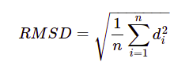
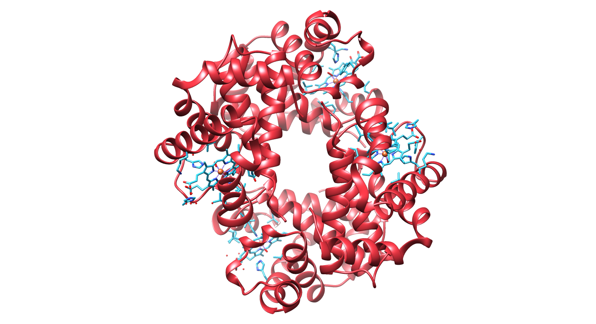
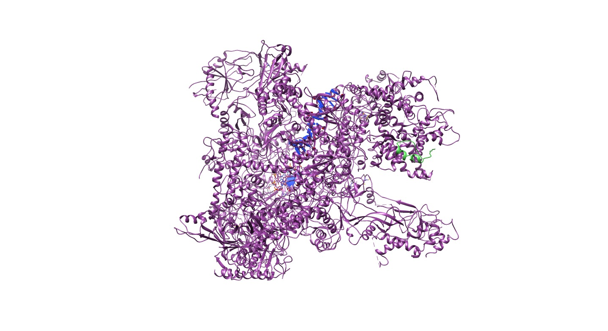
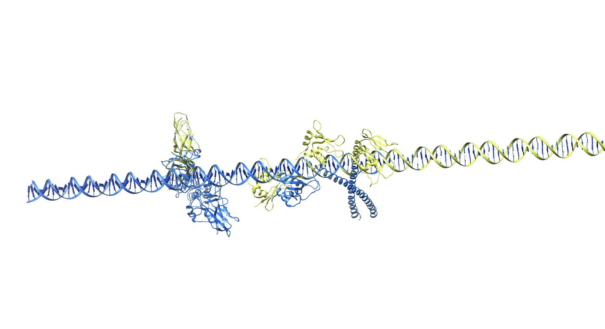
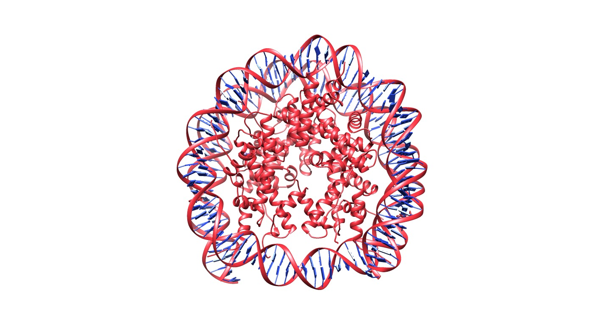

**BioComplex Builder Manual**
===================================
<br />
*by* Arnau Llinàs, Carla Folgado i Oriol Canal
*MSc Bioinformatics for Health Sciences, Pompeu Fabra University, Barcelona, 2021.*


<br />

# Introduction

BioComplex Builder is a bioinformatic tool written in Python program whose objective is to model macrocomplexes of proteins from PDB files of interacting chains and based on this information, construct the most likely macro-complex in a PDB file. BioComplex Builder is not only compatible with pairs of protein chains, in addition it can deal with DNA-proteins interactions to reconstruct the final complex.

You can source the code at the [github repository](https://github.com/carlafolgado/SBIPYTproject).
<br /><br />

# Biological background


Proteins are supramolecular structures that are comprised of 20 natural amino acids joined by peptide bonds, which constructs the primary structure. They play a central role in biological organisms by transferring information across the cell (i.e cell signalling), catalysing thousands of complex chemical reactions and transformingchemical energy into biological work.[1](
https://pubs.rsc.org/en/content/getauthorversionpdf/C3CS60474H)

The function of a protein is directly dependent on its 3D structure which is determined by the sequence of amino acids. However, proteins rarely act alone. It has been revealed that over 80% of proteins do not operate alone, but in complexes.[2](https://www.hindawi.com/journals/ijpro/2014/147648/)

Proteins interact with  other proteins or other biological molecules (DNA, RNA, lipids among others) through different interactions as electrostatic forces, hydrogen bonding or hydrophobic effect. The final result of these interactions is the formation of macrocomplexes allowing to acquire new functional capabilities to proteins. So, proteins have to be studied in the context of their interacting partners to understand their function.

So, protein-protein interactions (PPi) are crucial for the formation of macromolecules that are the basis of most cellular processes as signal transduction, activation or inhibition of proteins. To reveal the function mechanisms in cells, it is important to identify PPIs that take place in the organism.

In order to identify and study the PPIs, it has been used high-throughput experiments and computational methods. Small-scale experimental approaches can detect high quality PPI but with high time cost. On the other hand, computational methods and high throughput methods can detect a large amount of novel PPIs but with low quality and consequently with high number of false positives.[3](https://academic.oup.com/bib/article/18/5/798/2562794)

The program BioComplex Builder tries to assemble the structure of the complexes from the PDB files of interacting chains. Its biological background is based on different aspects applied on the algorithm:

* Superimposition:
<p>
It consists on the rotations and translations performed on one structure to match another structure. The best superimposition is the one that provides the minimum distance between the atoms. </p>

* RMSD values:
<p>
Root Mean Square Deviation (RMSD) is the most used measure of the similarity between two superimposed atomic coordinates. The RMSD values can be calculated from different subset of atoms ( typically calculated for the backbone heavy atoms i.e. Cα or Cβ atoms). The result is given in Angstroms and can be obtained from the following fromula:



Where di is the distance between atom i and either a reference structure over the n pairs of equivalent atoms
<br /><br />

# BioComplex algorithm

<br />

The main objective of the program is to reconstruct protein complexes (which may include DNA) from  PDB files of interacting chains.
The approach of the algorithm is based on different theore
<br />

### Parsing PDB files and stochiometry file

From the input PDB files (which can be compressed or not) containing information about two interacting chains that can be whether protein-protein interaction or DNA-protein interactions, the algorithm parse these files and transform it to PDB objects. In addition, if the stochiometry file is given in the arguments, it parses the file to return a dictionary where the key is the uniprot_id and the values the number of appearances.

<br />

### Constructing model without DNA chain as template

  First, the common chains in different PDB files are identified and are considered the same PDB object. The following step is to look for the most common chain of the PDB files of interacting chains and take it as core which will be added to the complex. Then by looking for interactions that have the core chain and superimposing  the core chain of the complex with the one that interacts with another subunit, the new chain is placed on the interacting site. The superimposition RMSD is checked and if the value is lower than a threshold and the new coordinates of the new chain have no clashes in the complex, then the new chain is added to the macrocomplex. In this moment the complex have 3 chains. In this way it tries to add all the chains that interacts with the core chain. Once all the interacting chains are placed, it assigns the second most found chain as core chain and adds all the chains that interact with him.  By using an iterative algorithm to assign different core chains, the different PDB interactions are added to the complex and the new chains that have not clashes and RMSD values behind the threshold are added to the final complex. The algorithm of BioComplex Builder is recursive until it has exhausted all the PDB objects. Finally it is obtained a PDB file of the macrocomplex in the output directory.
  

The solution given is not heuristic given that we start iterating over the core chain which is the one that is most represented in the input PDB files. In this way we reconstruct the model in a optimal way. 
<br />

### Constructing model using DNA template

In order to construct the complex with a DNA sequence, the PDB file of the whole DNA sequence (template DNA) have to be given using the argument --dna. The DNA template sequence will be used as the initial complex in order to reconstruct the complete complex.

Then it starts an iterative process for each PDB object given as input:

* First, for the PDB objects that we have parsed, we extract the DNA sequence (interacting DNA) and it is performed a local alignment between the template DNA and the interacting DNA in order to find the position where the interacting chains have to be plced. For the interacting DNA that have been alignmed with a % of identity higher than 99,9%. 
* From the local alignment the initial and final position of the alignment are stored in order to identify the region of the template DNA where the alignment has occurred.  

* In order to perform the superimposition, the superimposer method needs 2 objects with the same number of atoms. However, sometimes the final and the initial residues of the interacting DNA are not complete and consequently it can't be applied the superimposer method.  To avoid this problem, the algorithm detects if the number of atoms between the interacting chain and the nucleotides aligned in the template chain are not the same. If it is the case, the initial and final residues of the interacting chain are removed allowing to have a correct superimposition between the DNA sequences. 

* Once solved this problem, we can superimpose the DNA sequence that contain the interaction pair to the template DNA sequence io order to obtain the correct coordinates of the chain that interacts with the DNA.

* Then, the correct coordinates of the chain are added to the final complex if: 
<p>No clashes occurs between the chain added and the complex.
The RMSD value of the superimposition of the template DNA and the interacting DNA is behind the threshold.
The stoichometry of the chain have not arribe to 0.</p>

* If the chain is added, it is substracted the number of chains introduced to the complex in the stochiometry.

* Performing this process iterating for all the PDB objects that has been given as input, it is tried to build the final complex. The final complex is only returned when all the stociometry values are 0. 

* Finally, in order to obtain different models, it starts the process described trying to add the chains in different order to finally obtain 10 different models.

* The models created are evaluated energetically using DOPE score. In the output folder you will find the models constructed and a txt file where you can find a table with the number of each model and the DOPE score. This table is sorted by the scores of the models.


<br /><br />


# Installation
<br />

### Prerequisites:
- Python 3.0: `https://www.python.org/download/releases/3.0/`
- Biopython package: `https://biopython.org/wiki/Download`

### Installation from GitHub repository

```shell
$ git clone https://github.com/carlafolgado/SBI-PYTproject.git
$ cd SBI-PYT_Project
$ sudo python3 setup.py install
```
<br /><br />

# Organization of the program scripts

The program have been organized in different scripts:

* **builder.py:** <p>Where workflow of the program can be found. </p>
* **arguments.py:** <p>In this script are defined what arguments requires the program, and which ones are optional. It also automatically generates help and usage messages and issues errors when users give the program invalid arguments. </p>
* **utilities.py:**  <p>Where the functions for the executation of the program are stored.</p>
* **DNAbased_utilities.py:** <p>Where functions for the executation of the program when a DNA chain is given for the construction of the complex are stored.</p>

<br /><br />

# Argument options

BioComplex Builder have different arguments which some of them are mandatory to run the program and other are optional which help to deal with other information as how to give the total chain of DNA where the complex have to be built. 
<br />

### Command line options:

#### Required arguments:

* **-i, --input**
<p>Directory where input PDB files of interacting chains are located</p>


* **-o, --output**
<p>Directory where the PDB file of the macrocomplex constructed by the program will be found.</p>

#### Non required arguments:

* **-h, --help**
<p> Print a brief reminder of command line usage and all available options.</p>

* **-s, --stoichiometry**
<p>Path where the stoichiometry file of the complex is located</p>

* **-f, --force**
<p> When used this argument the created files of the program overwrite existing files in specified output path</p>

* **-v, --verbose**
<p> Display verbose progression log of the program</p>

* **--rmsd**
<p> Set rmsd threshold for chain superposition. Default value at 0.5 </p>

* **--dna**
<p> Path to the file with the template DNA when the macrocomplex have to be build using the DNA template as core. </p>

<br /><br />

# Examples

In this section, it will be shown some of the structures that the program has been able to reconstruct. These files can be found in the examples directory of the [github repository.](https://github.com/carlafolgado/SBIPYTproject)

<br />

## Example 1: 1GZX


The reference structure of the first example can be found in pdb with the code [1GZX](https://www.rcsb.org/structure/1GZX). It is an hemoglobin from *homo sapiens*.  The input of this example is the directory that contains the interacting PDB files.

If we have the program correctly installed, by running the following command the program should reconstruct the hemoglobin:

```shell
python builder.py -i examples/1gzx/ -o result/ -v -f
```
As we can see in the command, we have to execute the script builder.py using two mandatory arguments: 
 -i which indicates the path to the folder that contains the PDB files of the pairing interactions.
-o path where the complex will be build

In addition 2 optional argumenst can be used:

-v: if you want to obtain in STDERR a detailed progression of the program
-f: if you want to overwrite the existing files in the output directory (if file already exist).

If we compare the model constructed and the reference structure:


It can be observed that the model complex (red) is reconstructed perfectly with an RMSD of 0,000Å. For this reason the reference structure can't be seen because there is a completely overlap between structures. It can be observed that there are different prostetic groups from the reference structure that can't be modeled by the program. 
<br />

## Example 2: 5FJ8

The reference structure of the first example can be found in pdb with the code [5FJ8](https://www.rcsb.org/structure/5FJ8). It is a RNA polymerase III elongation complex from *Saccharomyces cerevisiae* which is formed by many different chains and RNA strand is part of the complex.

In order to reconstruct the complex we can execute the following command:
```shell
python builder.py -i examples/5fj8/ -o result/ -v -f --rmsd 1
```
In this command we have the previous arguments and in this case -f will overwrite the pdb file created from the previous example. In addition we have the argument:
--rmsd : Set RMSD threshold for chain superposition to 1 in order to add the chain to the final complex.

In order to determine if the program constructed the right complex, we have to compare it with the reference structure extracted from PDB:




In this image we can see the complex constructed by the program in purple and the reference structure in green. We can observe that almost all the structure modeled is equal to the reference. However, there is one chain that the algorithm have not included in the model (chain that it collored only in green). 
The RMSD between the reconstructed complex and the reference PDB file is 0.000 Å. For this reason, both models are completely equal and consequently the chains overlap and we can't see the reference structure when there is overlapping regions.

<br />

## Example 3: 2O61

The reference structure of the first example can be found in pdb with the code [2O61](https://www.rcsb.org/structure/2O61). It is a macrocomplex formed by different complexes: NFkB, IRF7, IRF3 and interferon-b enhancer. However, in this PDB it can't be found the zinc fingers that can be found as interacting chains in some PDB pairing interactions.
In addition, some of the complexes have a particular stochiometry, so we will need a stochiometry file (follow the model given in the folder (proteinID: stochiometry)of this example to create other stochiometry files and consequently construct new models with different stochiometry).

In this case we have different complexes that interacts with DNA. In this case we should give to the program the PDB DNA sequence as template to reconstruct the final complex.

In this case the program will give us different models of the reconstructed complex and a txt file where we can find the number of the complexes ordered by its DOPE score.


In order to reconstruct the complex we can execute the following command:

```shell
python builder.py -i examples/2O61/2O61 -o test/ -f --dna examples/2O61/infb_dna.pdb -s examples/2O61/stechiometry.txt -v
```
As we have DNA template as input we need to indicate it in the command line by using:
--dna : it indicates the path to the PDB file of the template DNA. **Please take the files from directory examples of the github repository where the PDB of the template DNA was cleaned (removed some lines in the PDB that were found between chains). ** 
-s : it indicates the path to the txt file where the stochiometry is indicated. 

If we compare our best model with the reference structure:



As we don't have a complete reference structure it was compared the complex using stochiometry with 4 chains of the complex [Q14653](https://www.uniprot.org/uniprot/Q14653)(3 seen in yellow and 1 in blue due to overlapping with the model with no stociometry) and a model without giving a stochiometry file that adds only 1 chain of each uniprot complex(blue). 

First of all we can see that the program have been able to reconstruct the final complex with the stochiometry given. The complexes are placed where the interacting DNA is aligned with the template DNA. In addition, looking at the text file created as output, the DOPE scores of the models are good indicating that we have been able to reconstruct different possible models with good scores. 

Comparing the model given stociometry and without giving it, we can see that the model with stociometry (yellow) have 3 chains more of the Q14653 complex. So, we can see that the program is able to construct different models using a DNA template  even if it is used a stociometry file or not. 
<br />

## Example 4: 3KUY

The reference structure of the first example can be found in pdb with the code [3KUY](https://www.rcsb.org/structure/3KUY).

In order to reconstruct the complex we can execute the following command:
```shell
python builder.py -i examples/3KUY/ -o result/ -v -f 
```


With this example it can be shown that the program allow to reconstruct the final complex. It have been able to reconstruct the DNA complex but not using the DNA as template, it used the pairing interactions of protein chains to reconstruct the final complex and consequently the final position of the DNA have been reconstructed correctly.

<br />

# LIMITATIONS

The limitations when constructing complexes from protein-protein interaction withoud a DNA template:

* The program can't construct the final complex when only giving as input an interaction domain. It requires complete chains.
* It can't construct different models from protein-protein interactions. It only reconstruct a single model.
* Protein-protein interactions with stechiometry can't be modelled.
* The chains to be superimposed needs to be identical (same number of atoms). 
* The program doesn't work well with proteins that have no end in one dimension, it only performs well with closed complexes.

The limitations when constructing complexes with DNA using a DNA template:

* It needs the template DNA in order to reconstruct the whole model.
<br />

# REFERENCES
1- *Orozco, Modesto, A theoretical view of protein dynamics, Chemical Society Reviews. https://pubs.rsc.org/en/content/getauthorversionpdf/C3CS60474H.
2- *V. Srinivasa Rao, K. Srinivas, G. N. Sujini, G. N. Sunand Kumar, "Protein-Protein Interaction Detection: Methods and Analysis", International Journal of Proteomics, vol. 2014, Article ID 147648, 12 pages, 2014. https://doi.org/10.1155/2014/147648*
3- *Xiaoqing Peng, Jianxin Wang, Wei Peng, Fang-Xiang Wu, Yi Pan, Protein–protein interactions: detection, reliability assessment and applications, Briefings in Bioinformatics, Volume 18, Issue 5, September 2017, Pages 798–819, https://doi.org/10.1093/bib/bbw066*
